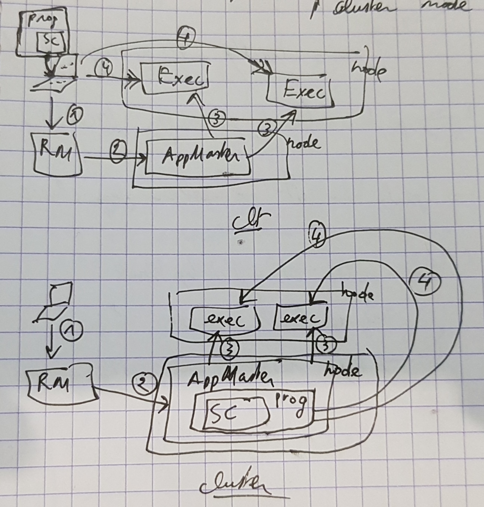
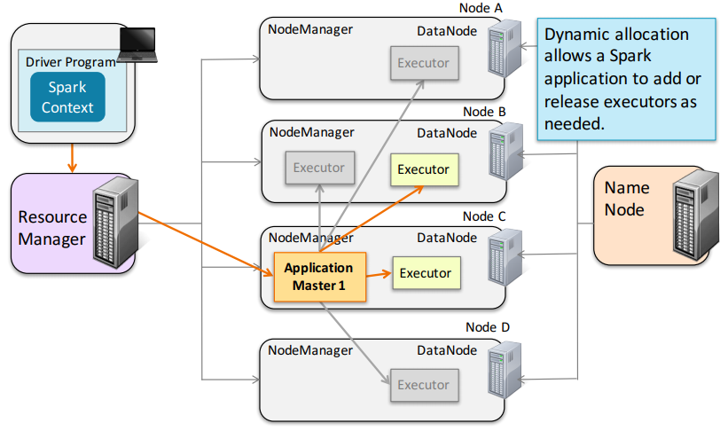

# CCA-175: Chapter 9

### Writing and Running Apache Spark Applications

- Spark app vs Spark shell

  - REPL: shell allows interaction 
  - App: runs as a program

- Spark Context

  - Shell: created in automatically, named sc by convention, sc.stop at the end
  - App: developer create the context using SparkContext 

  ```
  import org.apache.spark.SparkContext
  object WordCount {
  	def main(args: Array[String]) {
  		if (args.length < 1) {
  			System.err.println("Usage: WordCount <file>")
  			System.exit(1)
  	}
  	val sc = new SparkContext()
  	val counts = sc.textFile(args(0))
  				  .flatMap(line => line.split("\\W"))
  				  .map(word => (word,1))
  				  .reduceByKey(_ + _)
  	counts.take(5).foreach(println)
  	sc.stop()
  	}
  }
  ```

- Building an Apache Spark Application

  - Scala or Java: 
    - Spark app must be compiled and passed into a jar to the worker nodes
    - Use Maven for build
    - Build details will differ for HDFS version, deployment platform

- Running an Apache Spark App

  - spark-submit --class WordCount MyJarFile.jar fileURL  
  - spark-submit WordCount.py fileURL 

- Spark Application Cluster Options

  - Spark can run:
    - Locally 
      - with/ without distributed processing
      - with multiple worker threads 
    - On a cluster
    - Local mode is used for dev, Cluster is used for prod

- Cluster Resource Managers

  - YARN: Most common for production sites
  - Spark Standalone: Included with Spark, Useful for learning
  - Apache Mesos

- How Spark Runs on YARN: Cluster Mode/ Client Mode

  

- Running a Spark Application on Local

  - Specify the numbers of threads

    - local[*] runs locally with as many threads as cores (default)
    - local[n] runs locally with n threads
    - local runs locally with a single thread

    => spark-submit --master 'local[3]'  ...

- Running a Spark Application on a Cluster

  - Specify the cluster options

    - yarn-client 
    - yarn-cluster 
    - spark://masternode:port (Spark Standalone) 
    - mesos://masternode:port (Mesos) 

    =>  spark-submit --master yarn-cluster ...

- Spark shell can also be run on a cluster

  - pyspark and spark-shell both have a --master option

    - yarn (client	mode	only)
    - Spark or Mesos cluster manager URL 
    	 local[*] runs with as many	threads as cores (default) 
    - local[n] runs locally with n worker threads 
    - local runs locally without distributed processing 

    =>  spark-shell --master yarn 

- Dynamic allocation allows a Spark application to add or release executors as needed

  

  - It can be disabled

- Spark Web UI

  - http://localhost:4040 

### Essentials

- Use the Spark shell for interactive data exploration
- Write a Spark application to run independently
- Spark applications require a SparkContext object
- Use the spark-submit script to run Spark applications
- Spark is designed to run on a cluster
  - Most large production sites deploy on YARN (included in CDH)
- The resource manager distributes tasks to individual worker nodes in the cluster
  - Tasks run in executors—JVMs running on worker nodes