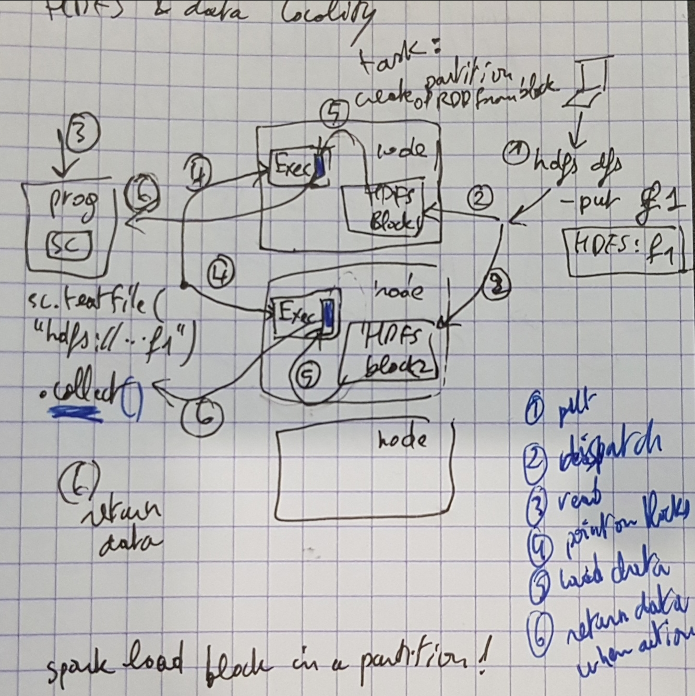
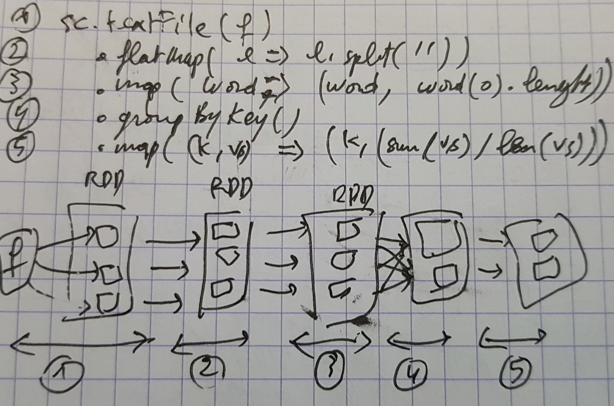
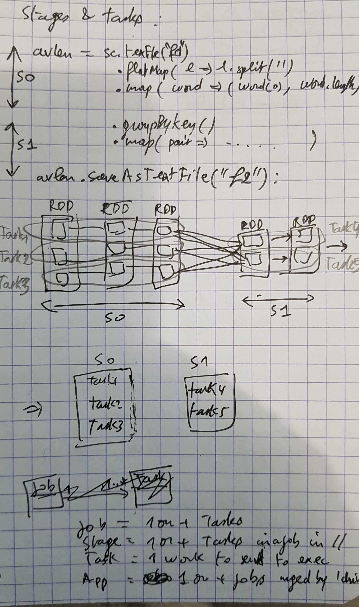

# CCA-175: Chapter 11

### Parallel Processing in Apache Spark

- Review of Spark on YARN

  

- Resilient Distributed Datasets 

  - Data is partitioned across worker nodes

  - Partitioning is done automatically by Spark: can control number of partitions

  - rdd_1 gives rdd_1_0, rdd_1_1, rdd_1_2 on each executor (executor is in a node)

  - textFile(file, minPartitions) 

  - Default:

    - 2 on cluster
    - 1 on  local with a single thread

    => more partitions => more parallelization 

- sc.textFile("mydir/*") 

  - each file becomes at least one partition
  - file-based ops can be done per-partition
  - Creates an RDD

- sc.wholeTextFiles("mydir") 

  - adapted for many small files
  - Creates a Pair RDD
    - => key = name, value = content

- Ops: 

  - Mot RDD ops are valid for each element of that RDD

  - foreachPartition, mapPartitions, mapPartitionsWithIndex 

    ```
    def printFirstLine(iter: Iterator[Any]) = {
    	println(iter.next)
    }
    val myrdd = …
    myrdd.foreachPartition(printFirstLine)
    ```

- HDFS and Data Locality 

  

- Execute parallel operations

  - RDD operations are executed in parallel on each partition
  - Operations preserve partitioning: map, flatMap, filter

  

- Stages and tasks

  - Operations that can run on the same partition are executed in stages 

  - Tasks within a stage are pipelined together

    

  - Job—a set of tasks executed as a result of an action

  - Stage—a set of tasks in a job that can be executed in parallel

  - Task—an individual unit of work sent to one executor

  - Application—the set of jobs managed by a single driver

- How Spark Calculates Stages

  - 

### Essentials

- RDDs are processed in the memory of Spark executor JVMs 
- Data is split into partitions—each partition in a separate executor
- RDD operations are executed on partitions in parallel
- Operations that depend on the same partition are pipelined together in stages
  - Examples: map and filter
- Operations that depend on multiple partitions are executed in separate stages
  - Examples: join and reduceByKey